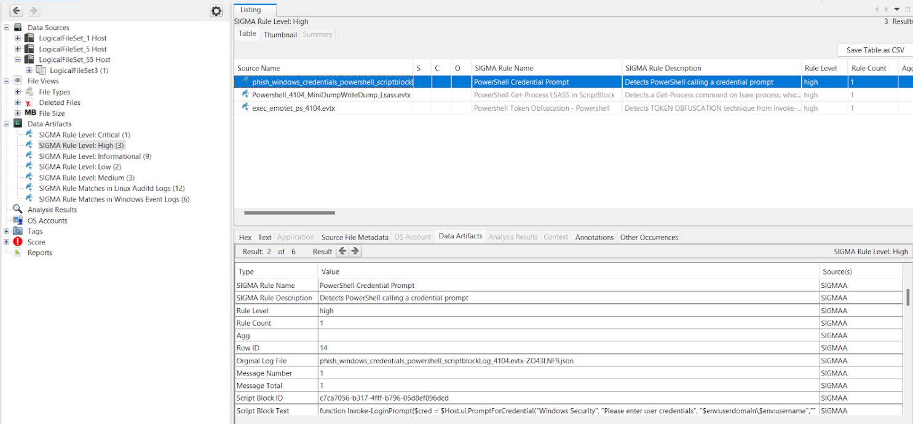

# <p align="center">SIGMAA: SIGMA Analyzer Module</p>

## Detection of IOCs in EVTX for Windows and Auditd for Linux based on SIGMA Rules 

- Users can import Sigma rules via YAML files or its respective JSON format into Autopsy through the module
- Users have the option to run specific rule sets within the SIGMAA module
- Able to display analysis results according to log type and rule level under the Data Artifacts section in Autopsy
- SIGMA rules can be applied on EVTX logs for Windows and Auditd logs for Linux


## Requirements / Installation

**This module can be used directly by cloning the repo and and place it in `C:\Users\<username>\AppData\Roaming\autopsy\python_modules` (Default Python Module path) in Autopsy**

**Alternatively, you can download the module in "Releases", unzip it, and place it in `C:\Users\<username>\AppData\Roaming\autopsy\python_modules` (Default Python Module path) in Autopsy**


## Important Note
**Installation of this module will be flagged by Antiviruses since some strings in the provided sample rules detects malicious attacks. This is the same with the Zircolite executable. If you wish to download the module without any sample Sigma rules or attack samples do download it at "Releases"**


## Quick Start

#### Sigma Rules for EVTX Logs : 

Users can import rule files in `.yml` format or its `.json` equivalent into the `EvtxRule` folder
> Do note that if `.json` files are used, only 1 `.json` file is accepted as input and it is prioritized from other `.yml` rules


#### Auditd for Linux Logs : 

Users can import rule files in `.yml` format or its `.json` equivalent into the `AuditdRule` folder
> Do note that if `.json` files are used, only 1 `.json` file is accepted as input and it is prioritized from other `.yml` rules


#### JSON Rule Format Generation : 

To convert  these rule files from `.yml` to `.json` format using the [sigma-cli](https://github.com/SigmaHQ/sigma-cli) tool, you have to leverage the sqlite backend and Zircolite mode.
```shell
sigma convert -t sqlite "yml_format_sigma_rule_path" -f zircolite -o output_file_name.json
```


#### Sample Rulesets Provided

- YML Format: `RuleCollection/SIGMAHQ` by [SigmaHQ](https://github.com/SigmaHQ/sigma)
- JSON Format: `RuleCollection/Zircolite` by [Zircolite](https://github.com/wagga40/Zircolite)

:information_source: Please note these rulesets are provided as an example [you should generate your own rulesets](#why-you-should-build-your-own-rulesets) but they can be very noisy or slow.


#### Sample Attack Samples Provided

- EVTX Attack Samples: In `EVTXSamplesCollection` by [sbousseaden](https://github.com/sbousseaden/EVTX-ATTACK-SAMPLES/tree/master)


#### Demo Attack Samples with Sigma Rule

- Attack Samples: In `DEMO_SAMPLES`
- EVTX Logs Related Rule Sample: In `EvtxRule/powershell`
- Auditd Logs Related Rule Sample: In `AuditdRule/auditd`


## Technologies Used
- [Zircolite](https://github.com/wagga40/Zircolite) as the Sigma rule detection tool
- Jython for the Autopsy data source ingest module